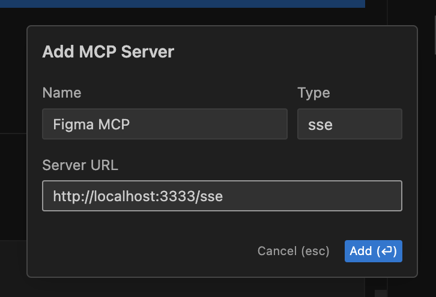
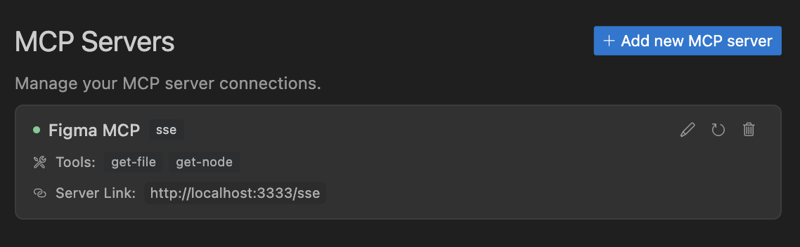
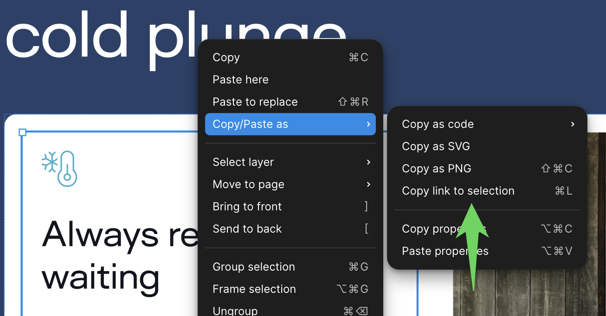

# Figma MCP Server

Give [Cursor](https://cursor.sh/), [Windsurf](https://codeium.com/windsurf), [Cline](https://cline.bot/), and other AI-powered coding tools access to your Figma files with this [Model Context Protocol](https://modelcontextprotocol.io/introduction) server.

When Cursor has access to Figma design data, it's **way** better at one-shotting designs accurately than alternative approaches like pasting screenshots.

Get started quickly, see [Configuration](#configuration) for more details:

```bash
npx figma-developer-mcp --figma-api-key=<your-figma-api-key>
```

## Demo Video

[Watch a demo of building a UI in Cursor with Figma design data](https://youtu.be/6G9yb-LrEqg)
[](https://youtu.be/6G9yb-LrEqg)

<a href="https://glama.ai/mcp/servers/kcftotr525"></a>

## How it works

1. Open Cursor's composer in agent mode.
1. Paste a link to a Figma file, frame, or group.
1. Ask Cursor to do something with the Figma file—e.g. implement a design.
1. Cursor will fetch the relevant metadata from Figma and use it to write your code.

This MCP server is specifically designed for use with Cursor. Before responding with context from the [Figma API](https://www.figma.com/developers/api), it simplifies and translates the response so only the most relevant layout and styling information is provided to the model.

Reducing the amount of context provided to the model helps make the AI more accurate and the responses more relevant.

## Features

This MCP server provides access to Figma design data through several tools:

- `get_figma_data`: Retrieves layout information about a Figma file or specific node
- `get_figma_styles`: Retrieves all local styles (colors, text, effects, grids) from a Figma file
- `get_figma_style_details`: Retrieves detailed information about specific styles
- `download_figma_images`: Downloads images used in a Figma file

### Accessing Local Styles

The server now supports retrieving local styles from Figma files, which can be particularly useful for design systems implementation. This includes:

- Color/fill styles
- Text styles
- Effect styles
- Grid styles

When retrieving a Figma file using `get_figma_data`, style information is now automatically included in the response. You can also use the dedicated style tools for more specific style-related requests.

## Installation

### Running the server quickly with NPM

You can run the server quickly without installing or building the repo using NPM:

```bash
npx figma-developer-mcp --figma-api-key=<your-figma-api-key>

# or
pnpx figma-developer-mcp --figma-api-key=<your-figma-api-key>

# or
yarn dlx figma-developer-mcp --figma-api-key=<your-figma-api-key>

# or
bunx figma-developer-mcp --figma-api-key=<your-figma-api-key>
```

Instructions on how to create a Figma API access token can be found [here](https://help.figma.com/hc/en-us/articles/8085703771159-Manage-personal-access-tokens).

### JSON config for tools that use configuration files

Many tools like Windsurf, Cline, and [Claude Desktop](https://claude.ai/download) use a configuration file to start the server.

The `figma-developer-mcp` server can be configured by adding the following to your configuration file:

```json
{
  "mcpServers": {
    "Framelink Figma MCP": {
      "command": "npx",
      "args": ["-y", "figma-developer-mcp", "--figma-api-key=<your-figma-api-key>", "--stdio"]
    }
  }
}
```

### Running the server from local source

1. Clone the [repository](https://github.com/GLips/Figma-Context-MCP)
2. Install dependencies with `pnpm install`
3. Copy `.env.example` to `.env` and fill in your [Figma API access token](https://help.figma.com/hc/en-us/articles/8085703771159-Manage-personal-access-tokens). Only read access is required.
4. Run the server with `pnpm run dev`, along with any of the flags from the [Command-line Arguments](#command-line-arguments) section.

## Configuration

The server can be configured using either environment variables (via `.env` file) or command-line arguments. Command-line arguments take precedence over environment variables.

### Environment Variables

- `FIGMA_API_KEY`: Your [Figma API access token](https://help.figma.com/hc/en-us/articles/8085703771159-Manage-personal-access-tokens) (required)
- `PORT`: The port to run the server on (default: 3333)

### Command-line Arguments

- `--version`: Show version number
- `--figma-api-key`: Your Figma API access token
- `--port`: The port to run the server on
- `--stdio`: Run the server in command mode, instead of default HTTP/SSE
- `--help`: Show help menu

## Connecting to Cursor

### Start the server

```bash
> npx figma-developer-mcp --figma-api-key=<your-figma-api-key>
# Initializing Figma MCP Server in HTTP mode on port 3333...
# HTTP server listening on port 3333
# SSE endpoint available at http://localhost:3333/sse
# Message endpoint available at http://localhost:3333/messages
```

### Connect Cursor to the MCP server

Once the server is running, [connect Cursor to the MCP server](https://docs.cursor.com/context/model-context-protocol) in Cursor's settings, under the features tab.



After the server has been connected, you can confirm Cursor's has a valid connection before getting started. If you get a green dot and the tools show up, you're good to go!



### Start using Composer with your Figma designs

Once the MCP server is connected, **you can start using the tools in Cursor's composer, as long as the composer is in agent mode.**

Dropping a link to a Figma file in the composer and asking Cursor to do something with it should automatically trigger the `get_file` tool.

Most Figma files end up being huge, so you'll probably want to link to a specific frame or group within the file. With a single element selected, you can hit `CMD + L` to copy the link to the element. You can also find it in the context menu:



Once you have a link to a specific element, you can drop it in the composer and ask Cursor to do something with it.

## Inspect Responses

To inspect responses from the MCP server more easily, you can run the `inspect` command, which launches the `@modelcontextprotocol/inspector` web UI for triggering tool calls and reviewing responses:

```bash
pnpm inspect
# > figma-mcp@0.1.12 inspect
# > pnpx @modelcontextprotocol/inspector
#
# Starting MCP inspector...
# Proxy server listening on port 3333
#
# 🔍 MCP Inspector is up and running at http://localhost:5173 🚀
```

## Available Tools

The server provides the following MCP tools:

### get_figma_data
Get layout information about a Figma file. 
- fileKey: The key of the Figma file to fetch
- nodeId: (optional) The ID of the node to fetch
- depth: (optional) How many levels deep to traverse the node tree

### get_figma_styles
Retrieve all local styles from a Figma file.
- fileKey: The key of the Figma file to fetch styles from

### get_figma_style_details
Retrieve detailed information about specific styles including their properties and values
- styleKeys: Array of style keys to fetch details for

### map_figma_styles_to_nodes
Map local styles to nodes in the Figma file, providing comprehensive style values and usage information.
- fileKey: The key of the Figma file to analyze
- nodeId: (optional) The ID of a specific node to analyze. If not provided, the entire file will be analyzed.

### detect_figma_style_usage
Detect where styles are used in a Figma file or node.
- fileKey: The key of the Figma file to analyze
- nodeId: (optional) The ID of a specific node to analyze

### download_figma_images
Download SVG and PNG images used in a Figma file based on the IDs of image or icon nodes
- fileKey: The key of the Figma file containing the node
- nodes: The nodes to fetch as images
- localPath: The absolute path to the directory where images are stored in the project

Each node object should have:
- nodeId: The ID of the Figma image node to fetch
- fileName: The local name for saving the fetched file
- imageRef: (optional) If a node has an imageRef fill, include this

## Example Usage

### Analyzing Style Usage

You can now retrieve a comprehensive mapping between local styles and their usage within a Figma file:

```javascript
// Map styles to nodes in a file
const styleMapping = await figmaService.mapNodesToLocalStyles('YOUR_FILE_KEY');

// Access the style values
console.log('Fill styles:', styleMapping.fillStyles);
console.log('Text styles:', styleMapping.textStyles);
console.log('Effect styles:', styleMapping.effectStyles);
console.log('Grid styles:', styleMapping.gridStyles);
```

The returned mapping provides:
- Style IDs and names
- Actual style values (colors, typography settings, effects, grid settings)
- Node IDs where each style is used
- Comprehensive correlation between style definitions and their usage
